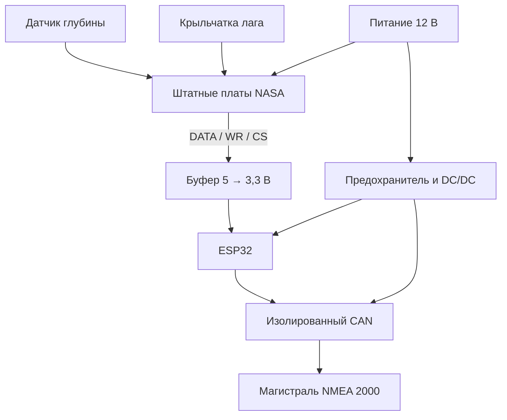

# Схема модульного прототипа

**Это дополнительный адаптер к работающим платам NASA. Входов сырых датчиков
на этой плате нет.** Размеры своей платы, разводка KiCad/Gerber и корпус для
полностью автономного устройства остаются задачей следующего этапа.

Сборка на паяемой макетной плате, с готовыми модулями ESP32, DC/DC и CAN.
Без опыта пайку проводов к NASA и переделку терминации CAN стоит поручить
мастеру. Эта документация даёт ему конкретные соединения.

## Цифровой вход — только внутри NASA

Точки ниже относятся к опубликованной плате с **PIC16C63A и HT1621**.
Проверить маркировку, ориентацию микросхем и прозвонку до HT1621 до пайки.
Считать ножки по виду сверху; со стороны пайки изображение зеркальное.
Не использовать эти номера для другой ревизии. Исходные фотографии:
[проект автора](https://github.com/speters/ClipperDuet2N2k/tree/27619d4b321be46d96fcb02a9dbee318b089d9bc/doc).

U1 = **SN74LVC125AD**, SOIC-14 на переходнике SOIC14→DIP14, питание 3,3 В.
Это фиксированное направление передачи. HC125/HCT125 и модули BSS138 для I²C
не считаются эквивалентной заменой.

| Откуда | Через | Куда | Назначение |
|---|---|---|---|
| NASA PIC ножка 4 | R1=1 кОм | U1 ножка 2 (1A) | DATA |
| U1 ножка 3 (1Y) | Провод | ESP32 GPIO23 | DATA 3,3 В |
| NASA PIC ножка 5 | R2=1 кОм | U1 ножка 5 (2A) | WR |
| U1 ножка 6 (2Y) | Провод | ESP32 GPIO18 | CLK 3,3 В |
| NASA PIC ножка 7 | R3=1 кОм | U1 ножка 9 (3A) | CS |
| U1 ножка 8 (3Y) | Провод | ESP32 GPIO27 | CS 3,3 В |
| NASA PIC ножка 8 / подтверждённая земля | Провод | GND_LOCAL | Общая земля логики |
| ESP32 3V3 | Провод | U1 ножка 14 | Питание буфера |
| GND_LOCAL | Провод | U1 ножки 1, 4, 7, 10, 12 | OE1–3, земля, неиспользуемый вход |
| ESP32 3V3 | Провод | U1 ножка 13 | OE4: неиспользуемый выход выключен |
| U1 ножка 11 | Не подключать | — | Y4 |

C1=100 нФ керамика между U1.14 и U1.7, максимально близко к корпусу;
C2=1 мкФ между 3V3 и GND_LOCAL рядом с U1. Добавить 1 МОм между U1.2 и землёй,
1 МОм между U1.5 и 3V3, 1 МОм между U1.9 и 3V3 для определённого уровня
при отсоединённом кабеле. От U1 до ESP32 — короткие соединения, до NASA
желательно не больше 10–15 см, с землёй рядом с каждой сигнальной жилой.
Эти линии не рассчитаны на метровый кабель.

Не подключать питание ESP32 к регулятору NASA или к PIC. У ESP32 отдельный DC/DC.
Датчики остаются в исходных гнёздах; не разветвлять коаксиал глубины.

## CAN: готовый модуль MIKROE-2627, схема v100

Это **CAN Isolator Click на ADM3053**, не CAN SPI Click с MCP2515.
Обе шины питания, 5V и 3V3, нужны одновременно. VIO SEL поставить в 3V3,
SLOPE SEL — HI. Названия TX/RX на странице магазина неоднозначны: подключать
по электрической цепи, подтверждённой прозвонкой при выключенном питании.
Несмотря на UART-примеры производителя, здесь TXD/RXD обслуживает CAN-контроллер.

| Сигнал адаптера | Точка CAN-модуля |
|---|---|
| 5V_LOCAL от DC/DC | Контакт +5V mikroBUS |
| 3V3 ESP32 | Контакт +3.3V mikroBUS, VIO SEL=3V3 |
| GND_LOCAL | Контакты GND mikroBUS (логическая сторона) |
| GPIO21, CAN TX | Линия TXD, соединённая с ADM3053 ножкой 5 |
| GPIO22, CAN RX | Линия RXD, соединённая с ADM3053 ножкой 4 |
| NMEA CAN-H | CN1 DB9 контакт 7, подтвердить до ADM3053.17 |
| NMEA CAN-L | CN1 DB9 контакт 2, подтвердить до ADM3053.15 |
| NMEA NET-C | CN1 DB9 контакт 3, подтвердить до GND_ISO |

R_TX=10 кОм от линии TXD к 3V3 удерживает recessive во время сброса.
**На модуле удалить R2 и R3 по 60,4 Ом** (маркировка R2/R3 именно CAN-модуля,
не входные резисторы адаптера). Это встроенный терминатор, который не нужен
на ответвлении NMEA. Проверить версию платы по
[схеме производителя](https://download.mikroe.com/documents/add-on-boards/click/can-isolator/can-isolator-click-schematic.pdf).
Если установлена иная ревизия — сначала сопоставить её схему.

**GND_ISO / NET-C не соединять с GND_LOCAL внутри адаптера.** Общая отрицательная
шина судна может соединять земли вне прибора; адаптер не добавляет ещё одну
проводящую перемычку. Это изолированный интерфейс, а не обещание полной изоляции
всего судна. DB9 здесь используется для CAN, подключение к RS-232 недопустимо.

## Micro-C / NMEA 2000

Предпочтителен готовый drop-кабель с разъёмом и открытым концом. Ориентироваться
на номера контактов и паспорт кабеля; цвет — дополнительный признак.

| Контакт | Обычно цвет | Соединение |
|---|---|---|
| 1 Shield | Оплётка/drain | Изолировать в прототипе; не соединять с логической землёй |
| 2 NET-S | Красный | **Не подключать**, индивидуально изолировать |
| 3 NET-C | Чёрный | CAN-модуль GND_ISO |
| 4 CAN-H | Белый | CANH |
| 5 CAN-L | Синий | CANL |

Адаптер имеет отдельное питание и не подаёт напряжение в NET-S. Поэтому в
Product Information выставлен LEN=0 (потребление от NET-S отсутствует).
Это не означает нулевого потребления от аккумулятора.
На магистрали остаются **два** терминатора по 120 Ом, по одному на концах.
На выключенной и обесточенной сети ожидается около 60 Ом CAN-H↔CAN-L;
при подключении адаптера сопротивление не должно существенно измениться.
Использовать короткое штатное ответвление (например 1 м) и T-коннектор.

## Питание и перемычка

От отдельной линии 12 В: F1=0,5 А → D1=SS34 (анод от F1, катод/полоска
к защищённому плюсу) → VIN модуля **Pololu D24V10F5**. Между защищённым плюсом
и GND_LOCAL: TVS **SMBJ18A**, катод к плюсу; C3=100 мкФ/50 В, плюс к плюсу.
GND DC/DC к GND_LOCAL; VOUT=5 В к входу **5V** DevKitC и +5V CAN-модуля.
Рядом с ESP32 C4=100 мкФ/10 В и C5=100 нФ между 5V и землёй.
Кнопки/питание NASA остаются штатными, через собственную защиту.

У DevKitC V4 подписанный вход 5V. У клонов VIN может отличаться — проверить
схему конкретной платы. Нельзя подавать 12 В ни на 5V, ни на 3V3.
SS34 защищает от переполюсовки, TVS подавляет ограниченные импульсы; эта схема
не испытана на все судовые перенапряжения. Использовать только систему 12 В.

ARM: двухконтактная перемычка GPIO32↔GND_LOCAL, внешний резистор 10 кОм
GPIO32↔3V3. При загрузке без перемычки CAN не запускается. Снятие перемычки
после запуска заменяет измерения на NA, но не выключает служебный обмен CAN.
Для полного отключения CAN снять перемычку и перезапустить питание.

## Конструкция

Винтовые/фиксируемые разъёмы, изоляция пайки и разгрузка кабеля; Dupont-провода
годятся только для стенда. Расположить DC/DC и изолированный CAN подальше от
аналоговой платы NASA. Сначала сравнить глубину при питании адаптера от чистых
5 В и от DC/DC: переключающий преобразователь может создать помехи.
Не заливать плату до испытаний и не наносить покрытие на разъёмы/USB/кнопки.
